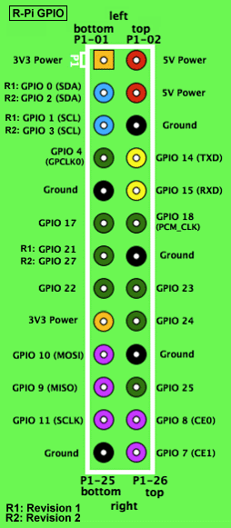

# RevEng_arduino_dwm1001 aka RevEng_dwm1001

Very simple Arduino serial wrapper driver for the Qorvo Decawave DWM1001 dev board.

- Product: Qorvo Decawave DWM1001
- Company: https://www.qorvo.com/
- Device: https://www.qorvo.com/products/p/DWM1001-DEV  
- Core chip: dw1000

RevEng_ardino_dwm1001 repository: https://github.com/acrandal/RevEng_arduino_dwm1001

***

### Wiring Notes:

dwm1001 header follows the RaspberryPi v1.0 26 pin header.
The key pins to power and connect the UART for the driver.

- 5v
- GND
- GPIO 14 (RXD)
- GPIO 15 (TXD)

***

### Serial port notes:

Usually requires HardwareSerial (Serial, Serial1, Serial2) at 115200.
Does not work (reliably) with SoftwareSerial due to high baud rate requirements.

Driver tested with ESP32.

***

Author: Aaron S. Crandall \<crandall@gonzaga.edu>  
Copyright: 2024  
License: GPL v3.0 |  https://www.gnu.org/licenses/gpl-3.0.en.html  

***

Other library with many more features for core dw1000 chip: https://www.arduino.cc/reference/en/libraries/dw1000/

